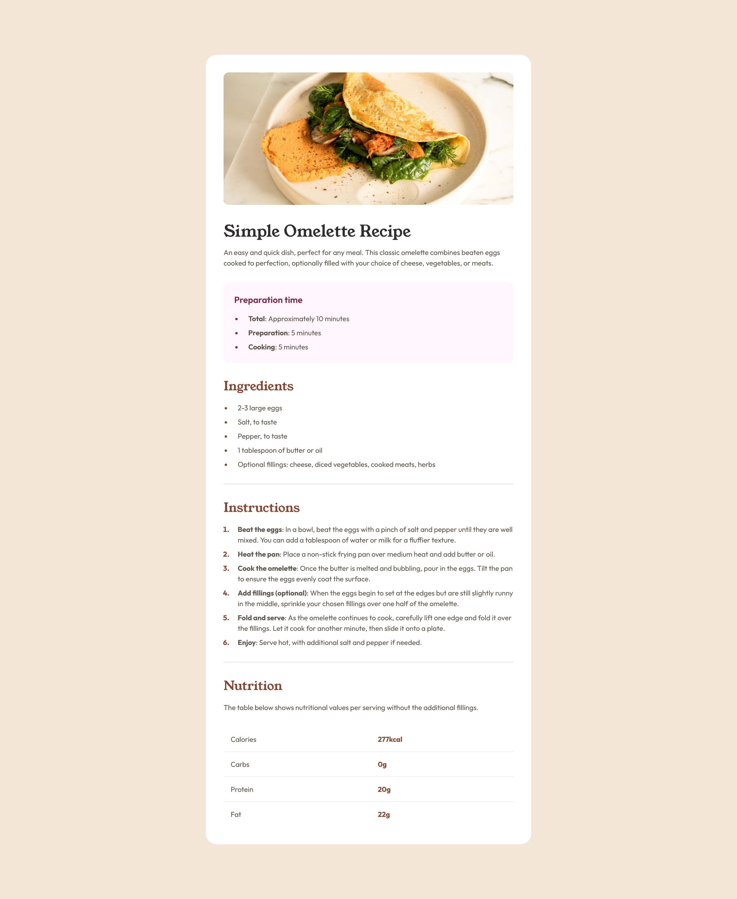

# Frontend Mentor - Recipe page solution

This is a solution to the [Recipe page challenge on Frontend Mentor](https://www.frontendmentor.io/challenges/recipe-page-KiTsR8QQKm). Frontend Mentor challenges help you improve your coding skills by building realistic projects. 

## Table of contents

- [Overview](#overview)
  - [The challenge](#the-challenge)
  - [Screenshot](#screenshot)
  - [Links](#links)
- [My process](#my-process)
  - [Built with](#built-with)
  - [What I learned](#what-i-learned)
- [Author](#author)

## Overview

### Screenshot

### Links

- Solution URL: [https://github.com/sannasinne/recipe-page](https://github.com/sannasinne/recipe-page)
- Live Site URL: [https://sannasinne.github.io/recipe-page/](https://sannasinne.github.io/recipe-page/)

## My process

### Built with

- Semantic HTML5 markup
- CSS custom properties

### What I learned

During this challenge I learned to build and style html tables. I also used ul and ol lists and styled the markers and lists. Generally a really good challenge to practice writing semantic HTML5 markup.

## Author

- Frontend Mentor - [@sannasinne](https://www.frontendmentor.io/profile/sannasinne)